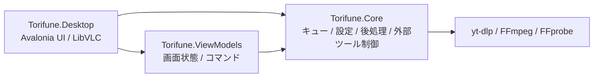

# Torifune

Torifune は、[yt-dlp](https://github.com/yt-dlp/yt-dlp) と [FFmpeg](https://ffmpeg.org/) を利用して、動画・音声の取得、プレビュー、音量正規化、FHD変換を行う Windows 向けデスクトップアプリケーションです。

コマンドライン操作を必要とせず、URLの解析からフォーマット選択、ダウンロードキュー管理、ダウンロード後の処理までを一つのGUIで扱えます。

> [!IMPORTANT]
> オンラインサービスや yt-dlp の仕様変更により、一部のURLで取得できなくなる場合があります。利用するサービスの規約、著作権、関連法令を確認し、権利のあるコンテンツに対して使用してください。

## 主な機能

### 動画・音声の取得

- 動画・プレイリストURLの解析
- 単一動画およびプレイリスト項目の選択ダウンロード
- 次のダウンロード方式を選択可能
  - 推奨: AVC/H.264 + AAC / MP4
  - 最高品質: 形式を自動選択
  - 音声のみ: AAC
  - 一覧選択: 映像・音声フォーマットを個別指定
- 開始・終了時刻を指定した区間ダウンロード
- 保存先フォルダと出力ファイル名テンプレートの設定
- 保存先設定の自動保存と、無効な保存先に対する既定Downloadsフォルダへの復帰

### ダウンロードキュー

- 複数項目のキュー管理
- 同時ダウンロード数の変更
- 進捗率、受信サイズ、速度、推定残り時間の表示
- 一時停止、再開、中止、再試行、削除
- キュー状態の永続化
- アプリ終了時の実行中プロセス停止と状態保存
- yt-dlp / FFmpeg の無応答監視
  - ETAや処理対象時間を基準に停止を判定
  - 関連プロセスを終了して1回だけ自動再試行

### 動画プレビュー

- 軽量プレビュー動画の取得とキャッシュ
- 360p / 480p / 720p のプレビュー品質選択
- 再生、停止、シーク、音量調整
- 現在位置を開始・終了時刻へ反映
- 正規化前後の音量波形表示
- LUFS、True Peak、LRAの比較

### 音声正規化

FFmpeg の `loudnorm` フィルターを使用した2パス音量正規化に対応しています。

- 配信向け: `-16 LUFS / -1.5 dBTP / LRA 11`
- 音楽向け: `-14 LUFS / -1.0 dBTP / LRA 9`
- カスタム設定
- AAC 192 kbps
- 出力サンプリング周波数を44.1 kHzまたは48 kHzに調整
- 96 kHz以上の入力は48 kHzへ変換

### FHDアップスケール

FHD未満の動画を1920x1080へ変換できます。

- 新規ダウンロード時の自動変換
- ダウンロード済み完了アイテムの手動変換
- Lanczosスケーラーを使用
- アスペクト比を維持し、不足領域は黒帯で補完
- H.264 / CRF 19 / `medium` プリセット
- 音声正規化と同時に指定した場合は最終書き出しを統合
- 失敗・キャンセル時は元ファイルを保持

通常のアップスケールは出力解像度を増やす処理であり、元映像に存在しない細部を復元するAIアップスケールではありません。

### 依存ツール管理と診断

- yt-dlp / FFmpeg / FFprobe の導入状態確認
- ユーザーの明示同意後に公式GitHub Releasesから取得
- ダウンロードしたツールのSHA-256検証
- yt-dlp更新機能
- アプリ内デバッグコンソール
- URLクエリ文字列とユーザーフォルダ名のログマスク

## 対応環境

| 項目 | 内容 |
| --- | --- |
| OS | Windows 10 / 11 x64 |
| ランタイム | .NET 10 |
| UI | Avalonia 12.1 |
| ダウンロード | yt-dlp |
| メディア処理 | FFmpeg / FFprobe |
| プレビュー再生 | LibVLCSharp |

現時点では Windows を第一級サポート対象としています。Core層はUI非依存ですが、Linux / macOS向けの依存ツール配布・実行経路は完成していません。

## 使い方

1. Torifuneを起動します。
2. 初回起動時に依存ツールの用途、取得元、ライセンスを確認します。
3. 内容に同意すると、yt-dlpとFFmpeg / FFprobeが公式配布元から取得されます。
4. 動画またはプレイリストのURLを入力し、`候補を解析` を押します。
5. ダウンロード方式、取得範囲、保存先、音声正規化、FHD変換を設定します。
6. `キューに追加` を押します。
7. `進行中` タブで進捗を確認します。
8. 完了後は再生、保存先フォルダの表示、FHD変換などを実行できます。

キュー追加に成功すると、URL、開始時刻、終了時刻の入力欄は次の追加に備えてリセットされます。

## ソースからのビルド

### 必要なもの

- Windows 10 / 11 x64
- [.NET 10 SDK](https://dotnet.microsoft.com/download)
- Git

開発時点ではVisual Studio CodeまたはVisual Studioを利用できます。

### 復元とビルド

```powershell
git clone <repository-url>
cd torifune
dotnet restore Torifune.slnx
dotnet build Torifune.slnx -c Debug /nr:false
```

### 実行

```powershell
dotnet run --project src/Torifune.Desktop/Torifune.Desktop.csproj -c Debug
```

### Releaseビルド

```powershell
dotnet restore Torifune.slnx --locked-mode
dotnet build Torifune.slnx -c Release --no-restore /nr:false
./scripts/publish.ps1 -Version 1.0.0
```

配布用スクリプトは `artifacts/release` にwin-x64自己完結型ZIPとSHA-256チェックサムを生成します。詳細は [リリース手順](docs/releasing.md) を参照してください。

### テスト

```powershell
dotnet test tests/Torifune.Core.Tests/Torifune.Core.Tests.csproj --nologo
```

テストでは、yt-dlp出力解析、引数生成、キュー制御、設定永続化、依存ツール検証、プレビューキャッシュ、停止時の自動復旧、FHD変換判定などを検証しています。

## プロジェクト構成

```text
torifune/
├── .github/
│   ├── dependabot.yml
│   └── workflows/
├── CHANGELOG.md
├── CONTRIBUTING.md
├── Directory.Build.props
├── Torifune.slnx
├── global.json
├── LICENSE
├── README.md
├── SECURITY.md
├── THIRD-PARTY-NOTICES.md
├── docs/
│   ├── basic-design.md
│   └── releasing.md
├── scripts/
│   ├── prepare-debug.ps1
│   └── publish.ps1
├── src/
│   ├── Torifune.Core/
│   │   ├── Models/
│   │   ├── Platform/
│   │   └── Services/
│   │       ├── Normalization/
│   │       ├── PostProcessing/
│   │       ├── Preview/
│   │       ├── Queue/
│   │       ├── Settings/
│   │       ├── Tools/
│   │       └── Ytdlp/
│   ├── Torifune.ViewModels/
│   └── Torifune.Desktop/
└── tests/
    └── Torifune.Core.Tests/
```

### レイヤ構成



- **Torifune.Core**: UI非依存のモデル、キュー、設定、yt-dlp連携、プレビュー、正規化、FHD後処理
- **Torifune.ViewModels**: UI状態、コマンド、入力検証、Coreサービスとの調整
- **Torifune.Desktop**: Avaloniaビュー、LibVLCプレビュー、DI構成、デバッグコンソール
- **Torifune.Core.Tests**: Core層とViewModelの単体・回帰テスト

## データ保存先

通常モードでは次の場所を使用します。

| データ | 保存先 |
| --- | --- |
| 設定 | `%APPDATA%\Torifune\settings.json` |
| キュー | `%APPDATA%\Torifune\queue.json` |
| yt-dlp / FFmpeg | `%LOCALAPPDATA%\Torifune\tools` |
| プレビューキャッシュ | `%TEMP%\torifune-preview-cache` |
| 波形・解析キャッシュ | `%TEMP%\torifune-preview-hist-cache` |

実行ファイルと同じ場所に `portable.txt` を置くとポータブルモードになり、設定・ツール・ログを実行ファイル付近の `data/`、`tools/`、`logs/` に保存します。

## 外部ツールについて

Torifuneはyt-dlpとFFmpegを同梱しません。初回起動時にユーザーが内容を確認して同意した場合のみ取得します。

- yt-dlp: <https://github.com/yt-dlp/yt-dlp/releases/latest>
- FFmpeg builds: <https://github.com/yt-dlp/FFmpeg-Builds/releases/latest>

外部ツールとNuGetパッケージには、それぞれの配布元が定めるライセンスが適用されます。詳細は各プロジェクトのライセンスを確認してください。

配布物に含まれるランタイム依存のライセンス情報は [THIRD-PARTY-NOTICES.md](THIRD-PARTY-NOTICES.md) にまとめています。

## 既知の事項

- オンラインサービスやyt-dlp側の仕様変更により、一時的に解析・ダウンロードできなくなる場合があります。
- 区間ダウンロード、音声正規化、FHD変換はFFmpeg処理を伴うため、動画時間やPC性能に応じて時間がかかります。
- FHD変換は通常の再エンコードであり、元動画以上の実質的な情報量を生成するものではありません。

## 開発ドキュメント

詳細な設計方針は [docs/basic-design.md](docs/basic-design.md) を参照してください。

設計書には将来構想も含まれており、現在の実装状況は本READMEおよびソースコードを正とします。

## コントリビューション

IssueやPull Requestを送る前に [CONTRIBUTING.md](CONTRIBUTING.md) を確認してください。

- 変更対象の振る舞いと再現手順を明記する
- 関連テストを追加または更新する
- `dotnet test` とReleaseビルドを通す
- yt-dlp / FFmpegの引数はシェル文字列ではなく `ProcessStartInfo.ArgumentList` で扱う
- ログへURLクエリやユーザー固有パスを直接出力しない

## ライセンス

Torifune本体は [MIT License](LICENSE) の下で公開されています。

yt-dlp、FFmpeg、NuGetパッケージなどの外部ソフトウェアには、それぞれの配布元が定めるライセンスが適用されます。詳細は [THIRD-PARTY-NOTICES.md](THIRD-PARTY-NOTICES.md) を参照してください。
