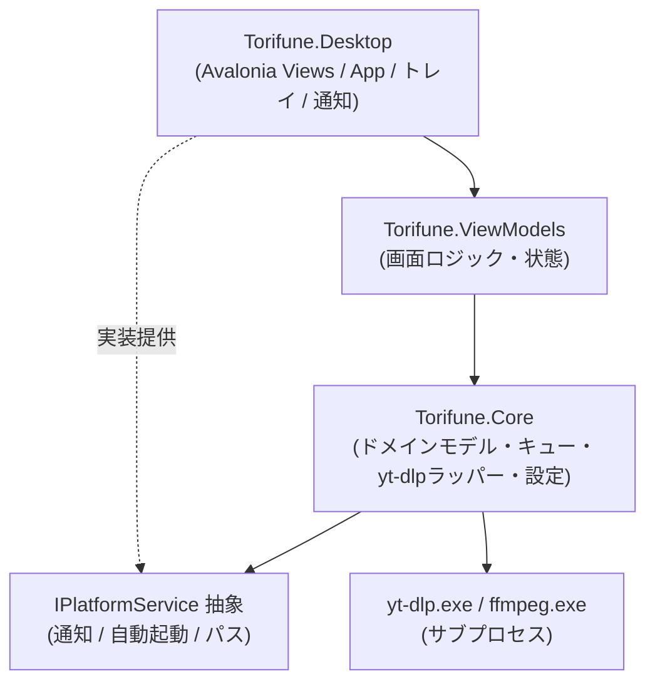
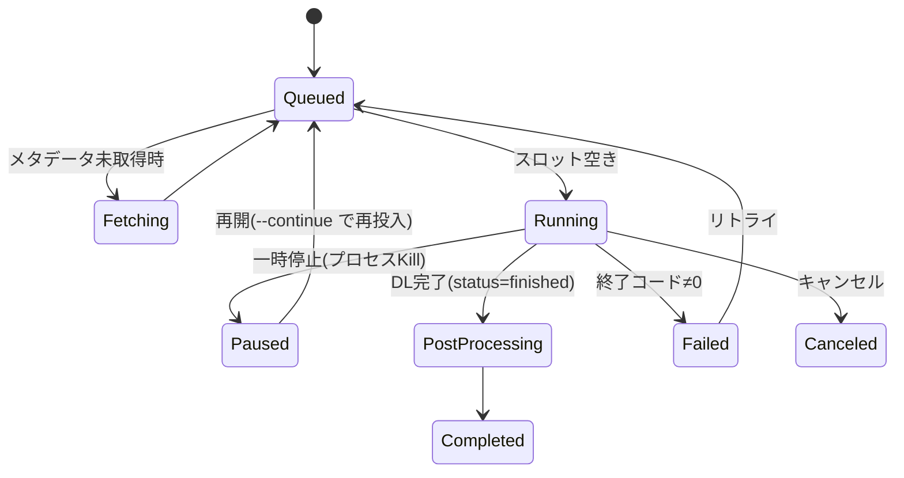

# Torifune 基本設計書

yt-dlp を利用した Windows 向け動画・音声ダウンロード GUI フロントエンド

| 項目 | 内容 |
| --- | --- |
| プロジェクト名 | **Torifune**(天鳥船。天と地を往来し神々を運んだ日本神話の船に由来) |
| バージョン | 設計 v1.0 (2026-08-31) |
| 対象プラットフォーム | Windows 10/11 x64(優先)、将来 Linux / macOS |
| ライセンス方針 | 自プロダクト: MIT License。yt-dlp / FFmpeg は同梱せず、用途・取得元・ライセンスを表示してユーザーが明示同意した場合のみ取得する |

---

## 1. 目的とコンセプト

- yt-dlp の強力な機能を、オリジナル UI で直感的に使えるようにする GUI フロントエンド
- **Parabolic の fork ではなく新規開発**。yt-dlp とはプロセス境界で疎結合に統合し、yt-dlp 更新の影響を最小化する
- Windows を第一級対象としつつ、コア層を UI 非依存に保ち将来のクロスプラットフォーム展開を可能にする

### v1 実装スコープ

1. URL 入力 → メタデータ取得 → 品質・形式選択 → ダウンロード
2. ダウンロードキュー・並列ダウンロード・進捗表示(速度/ETA/%)
3. プレイリスト対応(項目選択ダウンロード)
4. 推奨・最高品質・音声のみ・一覧選択によるフォーマット指定
5. 開始・終了時刻を指定した区間ダウンロード
6. 動画プレビュー、シーク、音量波形とLUFS比較
7. yt-dlp / FFmpeg の依存管理(非同梱、明示同意後に自動取得)・yt-dlp更新
8. ダウンロード後の音声正規化(FFmpeg `loudnorm` 2パス)
9. FHD未満の動画を1920x1080へ変換
10. 設定・キュー永続化、ポータブルモード、診断コンソール

### 非スコープ(v1 では対象外)

- 字幕・サムネイル・チャプターの埋め込み
- Cookie・SponsorBlock・クリップボード連携
- 多言語化、トレイ・OS通知
- ブラウザ拡張連携、ライブ配信の録画 UI、動画編集機能、スケジュールダウンロード
- インストーラ、自動更新

---

## 2. 技術スタック

| 分類 | 採用技術 | 備考 |
| --- | --- | --- |
| UI フレームワーク | **Avalonia 12.1.1**(FluentTheme) | Windows 10/11 x64を第一級サポート |
| ランタイム | .NET 10 LTS | win-x64 self-contained 配布 |
| MVVM | **CommunityToolkit.Mvvm 8.x** | ソースジェネレータ(`[ObservableProperty]`, `[RelayCommand]`) |
| DI | Microsoft.Extensions.DependencyInjection | |
| ローカライズ | 日本語UI | 多言語化は将来対応 |
| 配布 | PowerShell + GitHub Actions | ポータブルZIPとSHA-256を生成 |
| 自動更新・インストーラ | v1対象外 | コード署名証明書と更新フィード確定後に検討 |
| バックエンド | **yt-dlp.exe(サブプロセス)** + FFmpeg | 起動時は状態確認のみ。未導入なら同意画面を表示し、同意後に公式配布元から取得。配布物には同梱しない |
| ログ | Microsoft.Extensions.Logging + メモリ内診断コンソール | URLクエリとユーザーフォルダをマスク |
| テスト | xUnit(Core 層中心) | |

### yt-dlp 統合方式の選定理由

Python API 埋め込みではなく **exe サブプロセス方式** を採用する。

- メリット: yt-dlp 更新が exe 差し替えのみ(`-U` の自己更新も利用可)/C# 側に Python ランタイム不要/クラッシュ隔離/Parabolic と同方式で実績あり
- デメリット: 構造化出力(JSON)のパース層が必要/プロセス起動オーバーヘッド(実用上問題なし)

---

## 3. アーキテクチャ

### 3.1 レイヤ構成(クロスプラットフォーム拡張を見据えた分離)



- **Torifune.Core は Avalonia に依存しない**(net10.0の純粋 .NET)。将来 CLI 版・別 UI への差し替えが可能
- OS 依存機能(トースト通知、ブラウザ Cookie パス検出等)は `Torifune.Core` にインターフェイスを置き、Desktop 側でプラットフォーム実装を注入

### 3.2 ソリューション構成

```text
torifune/
├── Torifune.slnx
├── docs/
│   └── basic-design.md          (本書)
├── src/
│   ├── Torifune.Core/           # UI非依存コア
│   │   ├── Models/              # MediaInfo, FormatInfo, DownloadTask, DownloadOptions ...
│   │   ├── Services/
│   │   │   ├── Ytdlp/           # YtdlpService, ArgumentBuilder, OutputParser
│   │   │   ├── DownloadQueueService.cs
│   │   │   ├── ToolManager.cs   # yt-dlp/ffmpeg の取得・更新
│   │   │   ├── SettingsService.cs
│   │   │   └── ClipboardWatcher.cs (抽象; 実装はDesktop)
│   │   └── Platform/            # IPlatformNotifier, IAppPaths 等の抽象
│   ├── Torifune.ViewModels/     # MainViewModel, AddDownloadViewModel, SettingsViewModel ...
│   └── Torifune.Desktop/        # Avalonia アプリ本体 (Views, App.axaml, Program.cs, DI 構成)
├── tests/
│   └── Torifune.Core.Tests/
├── scripts/                     # デバッグ準備、リリースZIP生成
└── .github/                     # CI、リリース、Dependabot
```

---

## 4. yt-dlp 統合設計(Core/Services/Ytdlp)

### 4.1 コンポーネント

| クラス | 責務 |
| --- | --- |
| `YtdlpService` | プロセス起動・キャンセル(Process Kill + tree)・stdout/stderr ストリーム処理の一元化 |
| `YtdlpArgumentBuilder` | `DownloadOptions` → 引数リスト変換。**常に引数配列で渡し、シェル経由禁止**(コマンドインジェクション対策) |
| `YtdlpOutputParser` | メタデータ JSON / 進捗行 / エラー行のパース |
| `MediaInfoFetcher` | URL → `MediaInfo`(単体/プレイリスト)取得 |

### 4.2 メタデータ取得

```powershell
yt-dlp --ignore-config --no-warnings --skip-download --dump-single-json <URL>
```

- プレイリスト判定は出力 JSON の `_type == "playlist"` と `entries[]` で行う
- プレイリストは初回 `--flat-playlist` で軽量取得 → 選択された項目のみ後で詳細取得(大規模プレイリストの応答性確保)
- フォーマット選択 UI には `formats[]` の `format_id / ext / vcodec / acodec / width / height / fps / filesize / filesize_approx / tbr / abr / format_note / language` を使用

### 4.3 ダウンロード実行と進捗

進捗は Parabolic と同様、`--progress-template` で機械可読行を stdout に出力させてパースする:

```text
--newline --progress-delta 0.5
--progress-template "[TORIFUNE];%(progress.status)s;%(progress.downloaded_bytes)s;%(progress.total_bytes)s;%(progress.total_bytes_estimate)s;%(progress.speed)s;%(progress.eta)s"
```

- 行頭 `[TORIFUNE];` の行のみ進捗としてパース。フィールドは `;` 区切り
- `total_bytes` が NA の場合は `total_bytes_estimate` へフォールバック
- 完了ファイルパスは `--print after_move:filepath` で取得
- 出力安定化フラグ: `--ignore-config --no-warnings --color never --encoding utf-8 --windows-filenames`(Windows時)
- 終了コード 0 以外はエラー。stderr の `ERROR:` 行を収集しユーザー向けメッセージへ整形

### 4.4 引数マッピング(主要機能)

| 機能 | yt-dlp 引数 |
| --- | --- |
| 品質/形式(プリセット) | `-t mp4` / `-t mp3` 等 preset-alias、または `-f bv*+ba/b` + `-S` |
| 品質/形式(個別選択) | `-f <format_id>+<format_id>` |
| 品質/形式(上級者) | ユーザー入力の `-f` / `-S` 文字列をそのまま適用 |
| コンテナ変換 | `--remux-video` / `--recode-video` / `-x --audio-format` |
| 出力先/テンプレート | `-P <dir>` + `-o <template>`(GUI でテンプレート編集可) |
| 字幕 | `--write-subs --sub-langs <langs>` / `--embed-subs` |
| サムネイル | `--write-thumbnail` / `--embed-thumbnail` |
| メタデータ/チャプター | `--embed-metadata --embed-chapters` |
| Cookie | `--cookies-from-browser <browser>[:PROFILE]` |
| SponsorBlock | `--sponsorblock-mark <cats>` / `--sponsorblock-remove <cats>` |
| プレイリスト | `--yes-playlist -I <item_spec>` / `--no-playlist` |
| 帯域制限 | `-r <rate>` |
| ffmpeg 位置 | `--ffmpeg-location <path>`(ToolManager 管理パス) |

### 4.5 Cookie 連携の注意(Windows)

- 対応ブラウザ: chrome / edge / firefox / brave / vivaldi / opera 等
- Chromium 系は**ブラウザ起動中に Cookie DB がロックされ失敗する**ことがある → UI で「ブラウザを閉じてから再試行」を案内するエラーハンドリングを用意
- 取得失敗時は Netscape 形式 `cookies.txt` の手動指定(`--cookies`)もフォールバックとして提供

---

## 5. ダウンロードキュー設計

### 5.1 状態遷移



- 一時停止は yt-dlp にネイティブ pause がないため「プロセス停止 → `-c`(continue, 既定)で再開」方式
- 同時実行数は設定可能(既定 3)。`SemaphoreSlim` によるスロット制御
- キューは JSON でローカル永続化し、アプリ再起動時に未完了タスクを復元

### 5.2 主要モデル

```csharp
record MediaInfo(string Id, string Title, string Url, TimeSpan? Duration,
                 string? Thumbnail, IReadOnlyList<FormatInfo> Formats,
                 IReadOnlyList<SubtitleInfo> Subtitles, bool IsPlaylist, ...);

record FormatInfo(string FormatId, string? Ext, string? VCodec, string? ACodec,
                  int? Width, int? Height, double? Fps, long? Filesize, double? Tbr, ...);

class DownloadTask   // ObservableObject
{
    Guid Id; MediaInfo Media; DownloadOptions Options;
    DownloadStatus Status; double Progress; long Speed; TimeSpan? Eta;
    string? OutputPath; string? ErrorMessage;
}

record DownloadOptions(FormatSelection Format, string OutputDir, string OutputTemplate,
                       SubtitleOptions? Subs, bool EmbedThumbnail, bool EmbedMetadata,
                       CookieSource? Cookies, SponsorBlockOptions? SponsorBlock,
                       string? RateLimit, string? RawFormatString, string? RawSortString);
```

---

## 6. ツール管理(ToolManager)

- 管理対象: `yt-dlp.exe`, `ffmpeg.exe`/`ffprobe.exe`
- 配置先: `%LOCALAPPDATA%\Torifune\tools\`(ポータブルモード時は exe 隣接の `tools\`)
- 取得元:
  - yt-dlp: `https://github.com/yt-dlp/yt-dlp/releases/latest/download/yt-dlp.exe`
  - ffmpeg: `https://github.com/yt-dlp/FFmpeg-Builds`(yt-dlp 公式ビルド)の latest zip → 展開
- 未導入時は用途・取得元・ライセンスを画面表示し、確認チェックと「同意してダウンロード」の明示操作があるまでネットワーク取得を行わない
- 同意しない場合もアプリは終了せず、依存ツールが必要なダウンロード機能だけを無効にする
- 起動時は導入状態とローカル版を確認し、ユーザー操作でyt-dlpのstableチャネルへ更新する
- SHA-256 チェックサム検証(yt-dlp は `SHA2-256SUMS` を検証)
- **同梱しない**ことで自プロダクトのライセンスを yt-dlp 公式バイナリの GPLv3+ から分離

---

## 7. 将来UI構想(v1対象外を含む)

### 7.1 画面構成

```text
┌──────────────────────────────────────────────────┐
│ [＋URL追加]  [▶すべて開始] [⏸] [設定⚙]   ● DL中 2/3 │  ← ツールバー
├──────────────────────────────────────────────────┤
│ ┌─ キューリスト(仮想化 ListBox) ─────────────────┐ │
│ │ [サムネ] タイトル                               │ │
│ │        1080p mp4 | 45.2MB/120MB  2.1MB/s  ETA 0:35│ │
│ │        [━━━━━━━━━━░░░░░░] 38%   [⏸][✕][📂]      │ │
│ │ ────────────────────────────────────────────  │ │
│ │ [サムネ] タイトル2      ⏳待機中     [▶][✕]      │ │
│ └────────────────────────────────────────────────┘ │
├──────────────────────────────────────────────────┤
│ ステータスバー: yt-dlp 2026.07.04 | ffmpeg OK | 保存先 │
└──────────────────────────────────────────────────┘
```

- **メインウィンドウ**: キュー一覧が主役。1 タスク = 1 カード(サムネ・進捗・操作ボタン)
- **URL 追加ダイアログ**: URL 入力 → 解析中インジケータ → メタデータ表示 → オプション選択(タブ: 基本 / 形式 / 字幕・メタデータ / 上級)→ キュー追加
  - プレイリスト検出時はチェックボックス付き項目リストを表示
  - 形式タブ: 「プリセット(最高品質mp4 / 音声のみmp3 等)」「一覧から選択(formats テーブル)」「カスタム(-f/-S 直接入力)」の 3 モード
- **設定画面**: 一般(保存先・テンプレート・並列数・言語・テーマ)/ ネットワーク(プロキシ・帯域)/ 連携(Cookie ブラウザ・SponsorBlock 既定)/ ツール(yt-dlp・ffmpeg のバージョンと更新)
- **クリップボード検出**: メインウィンドウ在席時に URL をトースト風バナーで通知 →「追加」ワンクリック。設定で ON/OFF
- **トレイアイコン**: 閉じる=トレイ格納(設定可)。完了時に OS 通知

### 7.2 UX 原則

- 既定値で「URL 貼り付け → Enter → 最高品質 DL」が 2 アクションで完了すること
- 上級オプションは畳んで隠す(プログレッシブディスクロージャ)
- すべての長時間操作はキャンセル可能・UI 非ブロッキング

---

## 8. 設定・永続化

| データ | 形式 | 場所 |
| --- | --- | --- |
| アプリ設定 | JSON(`settings.json`) | `%APPDATA%\Torifune\`(ポータブル時: exe 隣接 `data\`) |
| キュー状態 | JSON(`queue.json`) | 同上 |
| ダウンロード履歴 | JSON or SQLite(件数増なら移行) | 同上 |
| ログ | メモリ内診断コンソール | アプリ終了時に破棄 |

- パス解決は `IAppPaths` 抽象経由(ポータブル/インストール/他OS の差異を吸収)

---

## 9. 配布・更新

| 形態 | 方式 |
| --- | --- |
| ポータブル | `scripts/publish.ps1`でwin-x64 SelfContained複数ファイルZIPとSHA-256を生成 |
| インストーラ | v1対象外 |
| アプリ自動更新 | v1対象外。GitHub Releasesから手動取得 |

- `PublishSingleFile=false`、`PublishTrimmed=false` とし、LibVLCのネイティブ資産を含む複数ファイル構成で配布する
- win-x64成果物からwin-x86・win-arm64のLibVLC資産を除外する
- GitHub Actionsはタグ `v<major>.<minor>.<patch>` でテスト、パッケージ生成、GitHub Releasesへの登録を行う
- 署名用Secretsが設定されている場合のみAuthenticode署名を行う

---

## 10. エラー処理・セキュリティ

- yt-dlp 実行は常に引数配列 + `UseShellExecute=false`。ユーザー入力をシェル文字列連結しない
- カスタム `-f`/`-S` 入力はそのまま渡すが、`--exec` 等の危険オプション注入を防ぐため**引数単位のホワイトリスト検証**を行う
- URL は `Uri.TryCreate` + http/https スキーム限定
- ツール DL は HTTPS + チェックサム検証
- stderr の `ERROR:` を分類(ネットワーク / 地域制限 / 認証必要 / フォーマットなし / Cookie ロック)し、対処ヒント付きで表示
- クラッシュ時もキュー JSON から復元可能にする(書き込みはアトミック置換)

---

## 11. クロスプラットフォーム拡張方針(優先度低・設計反映のみ)

- Core / ViewModels は OS 非依存を維持(CI でビルド確認)
- OS 依存点はすべて抽象化済み: `IPlatformNotifier`(トースト)、`IAppPaths`、`ITrayService`、ツール DL の対象アセット名(`yt-dlp` / `yt-dlp_macos`)
- Linux/macOS 展開時は Desktop プロジェクトに各実装を追加するのみ。Avalonia 側は原則共通 XAML

---

## 12. 開発フェーズ計画

| フェーズ | 内容 | 完了条件 |
| --- | --- | --- |
| P1: 骨格 | ソリューション作成、DI/MVVM 基盤、ToolManager(yt-dlp/FFmpeg 非同梱・同意後取得) | 未導入時に同意画面を表示し、同意後のみツール取得が動く |
| P2: コアDL | YtdlpService、メタデータ取得、単発ダウンロード + 進捗表示 | URL→最高品質DLが動く |
| P3: キュー | DownloadQueueService、並列制御、一時停止/再開/キャンセル、永続化 | キュー運用が安定 |
| P4: 形式選択 | フォーマット選択 UI(3モード)、字幕/サムネ/メタデータ、プレイリスト | v1 機能の大半 |
| P5: 連携 | Cookie 連携、SponsorBlock、クリップボード検出、トレイ/通知 | |
| P6: 仕上げ | 設定画面、i18n(ja/en)、ログ、エラー分類、テスト拡充 | |
| P7: 配布 | publishスクリプト、CI/CD、ポータブルZIP、ライセンス通知、README | 完了 |

---

## 13. 未決事項

- [x] プロジェクト正式名称: **Torifune** に決定 (2026-07-26)
- [ ] v1以降のアプリ自動更新方式と署名証明書
- [ ] 履歴の保存形式(JSON で開始し、必要になったら SQLite へ)
- [ ] .NET 10 リリース後の LTS 移行タイミング
